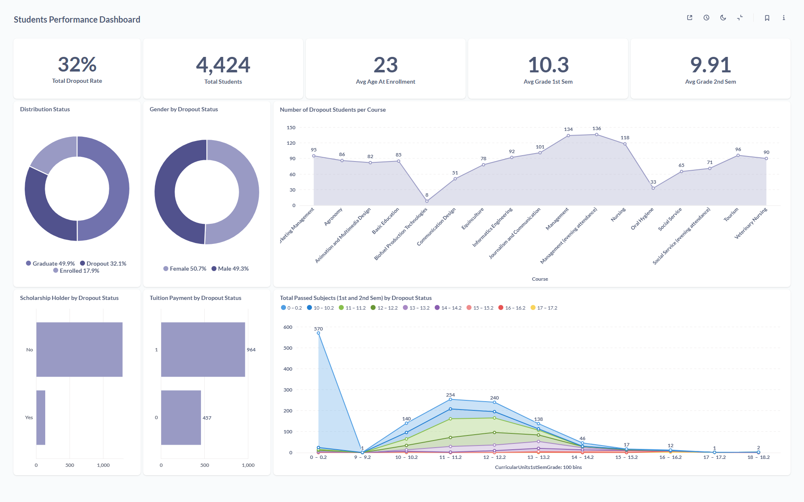

# 🏢 Proyek Akhir: Menyelesaikan Permasalahan Institusi Pendidikan

## Business Understanding

Jaya Jaya Institut merupakan salah satu institusi pendidikan tinggi yang telah berdiri sejak tahun 2000. Selama lebih dari dua dekade, institusi ini telah meluluskan banyak mahasiswa berprestasi dan memiliki reputasi akademik yang sangat baik.

Namun demikian, seiring waktu, Jaya Jaya Institut menghadapi tantangan serius terkait tingginya angka mahasiswa yang tidak menyelesaikan studinya (dropout). Fenomena dropout ini tidak hanya berdampak pada citra institusi, tetapi juga berpengaruh pada efektivitas sistem pembelajaran, akreditasi program studi, dan efisiensi operasional.

Sebagai bentuk respons terhadap permasalahan tersebut, pihak manajemen institusi ingin mengambil langkah strategis untuk mengidentifikasi mahasiswa yang berisiko dropout sejak dini agar dapat diberikan intervensi dan bimbingan yang tepat sasaran.

### Permasalahan Bisnis

Bagaimana Jaya Jaya Institut dapat mengidentifikasi secara dini mahasiswa yang berisiko tinggi melakukan dropout, guna meningkatkan retensi dan kualitas pendidikan di lingkungan institusi?

Pertanyaan utama ini dapat diuraikan menjadi beberapa sub-permasalahan:
- Apa saja faktor utama yang berkontribusi terhadap keputusan mahasiswa untuk berhenti studi?
- Bagaimana karakteristik sosial, ekonomi, akademik, dan demografis memengaruhi kemungkinan mahasiswa melakukan dropout?
- Strategi pemantauan apa yang dapat digunakan untuk membantu pihak institusi dalam mengidentifikasi tren dropout secara visual dan informatif?
- Bagaimana model machine learning dapat digunakan untuk memprediksi risiko dropout mahasiswa secara akurat dan praktis?

### Cakupan Proyek

Untuk menjawab permasalahan di atas, proyek ini memiliki dua fokus utama:

- **📊 Pembuatan Business Dashboard**

  Dashboard ini akan menampilkan visualisasi faktor-faktor penting yang berhubungan dengan performa dan retensi mahasiswa. Visualisasi akan mencakup metrik seperti:
    - Distribusi nilai akademik,
    - Tingkat kehadiran,
    - Status pembayaran uang kuliah,
    - Kebutuhan khusus dalam pendidikan,
    - dan berbagai indikator sosio-demografis lainnya.

  Dashboard ini bertujuan untuk membantu pengelola akademik dan manajemen dalam mengawasi dan memahami kondisi mahasiswa secara lebih menyeluruh.

- **🤖 Pengembangan Model Machine Learning**

  Model prediktif akan dikembangkan menggunakan pendekatan machine learning untuk memprediksi kemungkinan mahasiswa mengalami dropout. Model ini bertujuan untuk:
    - Mengidentifikasi mahasiswa berisiko tinggi secara otomatis
    - Mendukung pengambilan keputusan dalam pemberian intervensi dini (bimbingan atau konseling),
    - Mengurangi tingkat dropout dalam jangka panjang.

  Prototipe dari sistem prediksi ini akan dikembangkan menggunakan Streamlit agar dapat digunakan langsung oleh pihak institusi, serta di-deploy pada Streamlit Community Cloud agar dapat diakses secara remote.

<br>

## Persiapan

Dataset yang digunakan berasal dari Universitas fiktif Jaya Jaya Institut, yang tersedia di repositori berikut:

- 🔗 [Dataset Jaya Jaya Institut](https://raw.githubusercontent.com/dicodingacademy/dicoding_dataset/main/students_performance/data.csv).

### Install requirements

Pastikan semua library yang dibutuhkan telah terinstall:

```python
pip install -r requirements.txt
```

<br>

## Business Dashboard



Dashboard ini dibangun menggunakan Metabase dan dirancang untuk menganalisis performa akademik dan risiko dropout mahasiswa di Jaya Jaya Institut. Dashboard ini membantu pihak institusi, seperti dosen wali dan manajer akademik, dalam mengidentifikasi mahasiswa yang berpotensi mengalami dropout serta memahami faktor-faktor yang memengaruhi kelulusan.


### Metrik Utama

| **Visualisasi**           | **Tujuan Analisis**                                                                                |
| ------------------------- | -------------------------------------------------------------------------------------------------- |
| **Total Dropout Rate**    | Menunjukkan persentase keseluruhan mahasiswa yang mengalami dropout dari total populasi mahasiswa. |
| **Total Students**        | Jumlah total mahasiswa yang tercakup dalam data.                                                   |
| **Average Grade 1st Sem** | Menyajikan rata-rata nilai mahasiswa pada semester pertama.                                        |
| **Average Grade 2nd Sem** | Menunjukkan rata-rata nilai semester kedua, sebagai indikator progres akademik lanjutan.           |
| **Avg Age at Enrollment** | Menampilkan rata-rata usia mahasiswa saat pertama kali mendaftar.                                  |

### Visualisasi Berdasarkan Demografi dan Status

| **Visualisasi**         | **Tujuan Analisis**                                                                                     |
| ----------------------- | ------------------------------------------------------------------------------------------------------- |
| **Distribution Status** | Menampilkan proporsi mahasiswa dengan status *Graduate*, *Dropout*, dan *Enrolled*.                     |
| **Gender by Dropout Status**    | Menganalisis distribusi status kelulusan berdasarkan jenis kelamin (Male vs Female).                    |
| **Course by Dropout Status**    | Menunjukkan jumlah mahasiswa per program studi berdasarkan status akhir mereka (lulus, dropout, aktif). |


### Faktor Sosial dan Ekonomi

| **Visualisasi**                          | **Tujuan Analisis**                                                                     |
| ---------------------------------------- | --------------------------------------------------------------------------------------- |
| **Scholarship Holder by Dropout Status** | Menganalisis hubungan antara kepemilikan beasiswa dengan risiko dropout mahasiswa.      |
| **Tuition Payment by Dropout Status**    | Menilai pengaruh keterlambatan atau kelancaran pembayaran SPP terhadap tingkat dropout. |


###  Performa Akademik Mahasiswa

| **Visualisasi**                        | **Tujuan Analisis**                                                                                           |
| -------------------------------------- | ------------------------------------------------------------------------------------------------------------- |
| **Total Passed Subjects (1st and 2nd Sem) by Dropout Status** | Menunjukkan seberapa banyak mata kuliah yang diselesaikan mahasiswa pada semester 1 dan 2 berdasarkan status. |
|                                        | Semakin sedikit mata kuliah yang diselesaikan, semakin besar kemungkinan mahasiswa mengalami *dropout*.       |

